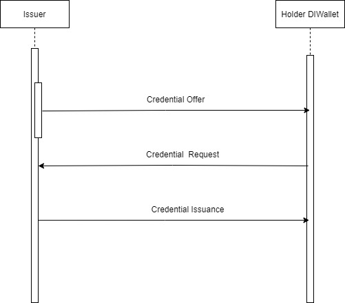

# Sample Issuer Application

The purpose of this application is to provide a quick-start on how to use DICE APIs for creating and issuing Verifiable Credentials

## Pre-requisite
Different stakeholders involved are:
- Identity Wallet 
- Issuer platform and
- Sample Issuer application
- Python version >=3
- Python package aiohttp

Issuer is available at: https://futureapi.diceid.com/swagger-ui.html 

Holder should have Identity Wallet application, DICE identity wallet installed on their mobile phone. The wallet is available on both Android and iOS platforms.
- On iOS, it be can downloaded from: [DICE ID - Apple playstore](https://apps.apple.com/in/app/dice-id/id1624858853)
- On Android, the link is: [DICE ID - Apps on Google Play](https://play.google.com/store/apps/details?id=com.diwallet1)

Python can be installed on your ubuntu machine as follows:
- apt-get update
- apt-get install python3

Python package aiohttp can be installed with:
 - pip3 install aiohttp~=3.8.1
 
 
## How to run
The application can be started with the command
- python sample_issuer.py

## Credential Issuance
Through the sample issuer application, sample_issuer.py, credential Issuance happens in the following steps.
1. Create Connection
   - 1a. Create New Connection Invitation
     -	It takes user email id as input and sends invitation link to this email address. The click on this link will take you to the QR code page. Holder should scan the QR code to establish connection with the Issuer. The API used for creating and sending this connection invitation is: 
     -	https://futureapi.***.com/swagger-ui.html#connections-controller/, POST /submit
     Example of connection link: https://futureapi.***.***/verify/412fc346-505a-4ed3-a121-19075db90784 where **412fc346-505a-4ed3-a121-19075db90784** is the connection id. 
    - 1b. Use Existing Connection: Use this option, if you have already established connection with DICE Issuer platform 
	
2. Create schema
   - 2a. Create New Schema: Use this option for new schema creation. The API used for this is: https://futureapi.diceid.com/swagger-ui.html#/schema-controller, POST /api/schema/createSchema. By default schema is created with the following attributes:
      - Name,
      - Age,
      - PAN
      - Postal Address

      These attributes were selected as one can use these attribytes for eKYC (Know Your Customer) usecases. This API will create schema as well as credential definition. One can modify sample_issuer.py to customize this schema as per the requirements.
   - 2b. Use existing Schema: If you have already created a schema or required schema exists with DICE issuer platform, then one can use this option. To view all the existing schema's, use API:  https://futureapi.diceid.com/swagger-ui.html#/, POST /api/schema getAllSchema
   
3. Issue Credential: This happens in 3 steps
   - Issuers sends credential offer to Holder. The REST API used for credential offer is: https://futureapi.diceid.com/swagger-ui.html#/credentials-controller/, POST
/api/credentialoffer. In the sample issuer application, the schema attribute values are taken as input. It also takes connection id as input which can be obtained from invitation URL.   
   - Once Holder receives the offer, holder accepts and sends credential request 
   - After receiving credential request from holder, DICE Issuer paltform will automatically issue credential with API: https://futureapi.diceid.com/swagger-ui.html#/credentials-controller/, POST /api/issue-credential/records/{credential_exchange_id}/issue. Credential exchange id is obtained from Credential-offer API output 
 
 ## Flow Diagram
   

